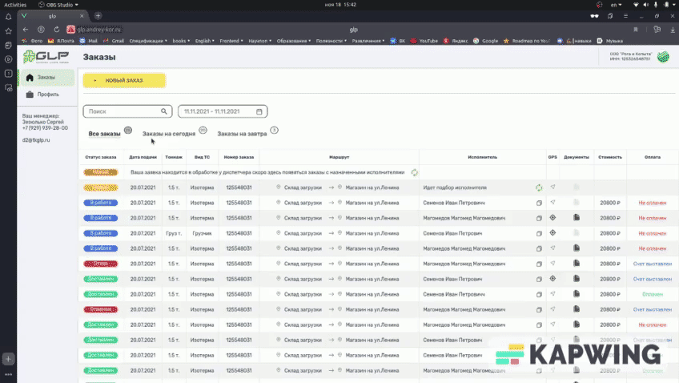

# МОНИТОР ОТСЛЕЖИВАНИЯ ЗАКАЗОВ
## Базовое описание
Монитор для отслеживания заказов написан на Vue.js. Содержит функции фильтрации по ключевым словам, диапазону дат, а также показывать заказы на сегодня и завтра.  
<em>Цель проекта - познакомиться с фреймворком Vue.js</em>

  

 

## Особенности:
- Проект намеренно написан без подключения сторонних библиотек (например, для выбора диапазона дат);
- Фильтрация:
    - по ключевым словам (для всех категорий);
    - по ближайшим датам;
    - по диапазону дат;
- Фильтры применяются совместно, показывая общий результат.

## Используемые инструменты:
- Vue;
- HTML;
- CSS.
